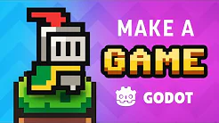

# Salut ! Moi c'est Quentin

### **Développeur débutant de jeux vidéo passionné par la création de nouvelles expériences.**

Ce que j'aime dans cette création, c'est transformer mes idées (complexes ou pas) en code et d'essayer de nouvelles mécaniques. Quand je ne code pas, je joue aux jeux vidéo, je sors avec des potes, je regarde des films/séries... et souvent c'est ce qui m'inspire à vouloir créer, soit de rien, soit en mélangeant l'univers du jeu vidéo et mon expérience.

---

## Ma Boîte à Outils 

| Secteur | Technologies |
| --- | --- |
| **Game Dev** | Godot, GDScript |
| **Logic & Scripting** | Python |
| **Développement Web** | HTML5, CSS3, JavaScript, JSON |
| **Outils & Pipeline** | Git, VS Code |

---

## Ma formation

Je n'ai pas encore de projet de jeu terminé car je me forme activement. À la place, je vous propose de suivre ma progression technique à travers les modules de **Godot University** :

<h3 align="center">
Voici la playlist avec laquelle je me forme 
</h3>

## Voici donc ma progression sur chacune des vidéos de la playlist

 

  <h3>Making a Game from Start to Finish (Tutorial)</h3>

  <table align="center">
    <tr>
      <td>
        
      </td>
      <td align="left" valign="middle">
        
<b>Statut :</b>

        
         
        
<i>Dernière mise à jour : 09/02/2026</i>

      </td>
    </tr>
  </table>

  

    <b>Résumé :</b> Présentation de la création d'un jeu de A à Z. Ce n'est pas un tuto mais une démonstration pour montrer à quoi s'attendre.
  

  

  <h3>How to make a Video Game - Godot Beginner Tutorial</h3>

  <table align="center">
    <tr>
      <td>
        
      </td>
      <td align="left" valign="middle">
        
<b>Statut :</b>

        
         
        
<i>Dernière mise à jour : 06/02/2026</i>

      </td>
    </tr>
  </table>

  

    <b>Résumé :</b> Apprendre à se familiariser avec Godot et le vocabulaire de la programmation de jeux vidéo en créant un petit jeu de plateforme en 2D.
  

  

