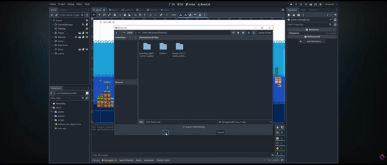

<h1 align="center">How to make a Video Game - Godot Beginner Tutorial</h1>

  <b>Formation :</b> Godot University | <b>Dossier source :</b> image_d_02

---

<!--case 1-->

<table>
  <tr>
    <td width="50%">
      
    </td>
    <td>
      <h3> Les assets : </h3>
      
Dans cette partie on nous apprend les différents types d'assets et qu'est ce qu'ils représentent

    </td>
  </tr>
</table>

<!--case 2-->

<table>
  <tr>
    <td>
      <h3> Comment fonctionne godot ? </h3>
      
On nous explique comment fonctionne Godot a partir de Nodes 

    </td>
    <td width="50%">
      
    </td>
  </tr>
</table>

<!--case 3-->

<table>
  <tr>
    <td width="50%">
      
    </td>
    <td>
      <h3> Le joueur 1.0 : </h3>
      
 On commence la création du jeu, pour cela on créé le personage que le joueur va incarner, (on va l'appeller "joueur" c'est plus rapide) on lui ajoute une animation  un hitbox, des méchaniques de saut de déplacement et pour l'instant c'est tout ! 

    </td>
  </tr>
</table>

<!--case 4-->

<table>
  <tr>
    <td>
      <h3> La construction du monde 1.0 :  </h3>
      
Ici on apprend a utiliser la tilemap, très utile pour construire un monde et très ludique, il suffit d'avoirpour chauques types de blocs constituant notre monde une case pour les placer en illimité /p>
    </td>
    <td width="50%">
      
    </td>
  </tr>
</table>

<!--case 5-->

<table>
  <tr>
    <td width="50%">
      
    </td>
    <td>
      <h3> Les plateformes : </h3>
      
Les plateformes sont vraiment simples a faire, et efficace, pourquoi ? Parce quelle reprennent le système du joueur, c'est une "scene" donc on a plus de liberté que pour la tilemap et on peut y affecter du code pour pouvoir passer par en dessous de la plateforme par exemple

    </td>
  </tr>
</table>

<!--case 6-->

<table>
  <tr>
    <td>
      <h3> les Collectibles : </h3>
      
Les collectibles sont important en jeux surtout ici car c'est le but principal de ce projet, on récupeer des pieces, on appprend a les faires disparaitres et a augmenter un compteur quand le joueur passe sur une d'elle, on apprend aussi a les changer de palier de collision pour pas que les plateformes mouvantres "rammasent" aussi les pieces 

    </td>
    <td width="50%">
      
    </td>
  </tr>
</table>

<!--case 7-->

<table>
  <tr>
    <td width="50%">
      
    </td>
    <td>
      <h3> Mourrir 1.0 : </h3>
      
La mort est la méchanique principale de presque tout les jeux au monde donc il est normal qu'on apprennent a en faire une ici aussi n'est ce pas ? Pour ca on va metre une hitbox sous notre monde comme ça quand le joueur tombera dans un trou il va toucher cette hitbox, on a juste a lui assigenr le code de nous faire réaparaitre et de reset le monde et le tour est joué ! 

    </td>
  </tr>
</table>

<!--case 8-->

<table>
  <tr>
    <td>
      <h3> La construction du monde 2.0 :  </h3>
      
Ici c'est une petite étape détente, on se sert de ce qu'on a appris pour faire notre prorpe niveaux avec nos scene, nos scripts, nos tilemaps. MAIS, on apprend aussi a fairte un arriere plan, qui se résume a créer une deuxieme tilemap qu'on posisione en arriere plan, ça peut etre pratique si on veux faire des passsages secrets ;) 

    </td>
    <td width="50%">
      
    </td>
  </tr>
</table>

<!--case 9-->

<table>
  <tr>
    <td width="50%">
      
    </td>
    <td>
      <h3> Les ennemis </h3>
      
Avoir des ennemis dans un jeux c'est important quand meme, alors on nous apprend a les faires, c'est une scene comme le joueur ou les plateformes, on lui donne une annimation qui fait office d'apparence, on lui code des déplacement une hitbox, une killzone, et c'est tout ce qu'on fera pour lui dans cette vidéo.

    </td>
  </tr>
</table>

<!--case 10-->

<table>
  <tr>
    <td>
      <h3> Mourrir 2.0 : </h3>
      
On a de base une mort vraiment basique, alorzs cette partie de la vidéo sert a améliorer cette mort, on vas ralentir le temps et enlever l'hitbox de notre joueur qu'il meurt face a un ennemi ou qu'il tombe dans le vide.

    </td>
    <td width="50%">
      
    </td>
  </tr>
</table>

<!--case 11-->

<table>
  <tr>
    <td width="50%">
      
    </td>
     <td>
      <h3> Le joueur 2.0 :  </h3>
      
c'est pareil pour notre joueur, il est basique alors on l'améliore, on lui donne 2 autres animations, le  saut et la course, et on fait en sorte de configurer les touches : avancer, sauter, reculer, etc... 

    </td>
  </tr>
</table>

<!--case 12-->

<table>
  <tr>
     <td>
      <h3> Ajouter du texte : </h3>
      
Pour ajouter de l'histoire, des quêtes ou faire parler des pnj il nous fautdu texte, alors on apprend a en afficher, a changer la police, la taille etc 

    </td>
    <td width="50%">
      
    </td>
  </tr>
</table>

<!--case 13-->

<table>
  <tr>
    <td width="50%">
      
    </td>
     <td>
      <h3> Créer un score : </h3>
      
Le texte sert aussi a avoir un score de fin de partie, et c'est a ca que servent les pieces, ici on programe notre texte pour qu'il affiche notre compteur de piece a la fin du niveau 

    </td>
  </tr>
</table>

<!--case 14-->

<table>
  <tr>
    <td>
      <h3> Ajouter du son </h3>
      
Pour rendre l'experience de jeux plus intérésente on ajoute une musique de fond et des bruit de collecte de piece 

    </td>
    <td width="50%">
      
    </td>
  </tr>
</table>

<!--case 15-->

<table>
  <tr>
    <td width="50%">
      
    </td>
    <td>
      <h3>Exporter le projet : </h3>
      
Voila ! On a fini notre mini jeu !!! Bon ce sera pas le goty 2026 mais c'est quand meme pas mal non ? .

    </td>
  </tr>
</table>

---

 J'aimerais préciser quand meme que cette vidéo est ici a but démonstratif et qu'en aucun cas elle me permet de créer un jeux a moi seul, j'en serait bloqué a des méchaniques de 1990. cette vidéo nous familiarise a comment utiliser godot et a en comprendre le vocabulaire, en plus au final on a un petit jeu comme récompense : 

[Mon jeu](https://Quentin-de-poli.github.io/formations/comment faire un jeux/)
  

  

